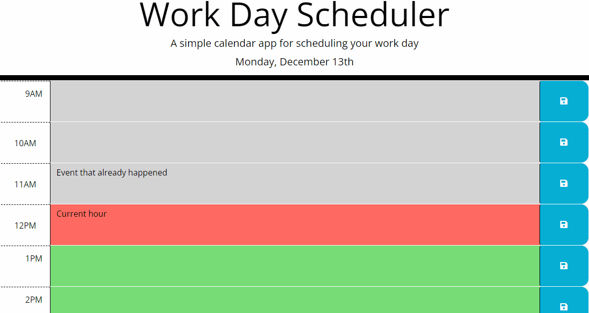

# Day-planner

[](https://opensource.org/licenses/MIT) 



## Description

Application for planning work time. shows the current date and time. displays past present and future tenses in different colors. writes data to local storage and displays a message about saving the data.

the site can be opened via the link -> [here](https://khomych1004.github.io/Day-planner/)

## Usage
```
run index file

```

## Credits

To create the application, I used resources on:
[MDN Web Docs](https://developer.mozilla.org)
||
[GitHub Docs](https://docs.github.com)
||
[W3Schools](https://www.w3schools.com/)

##


